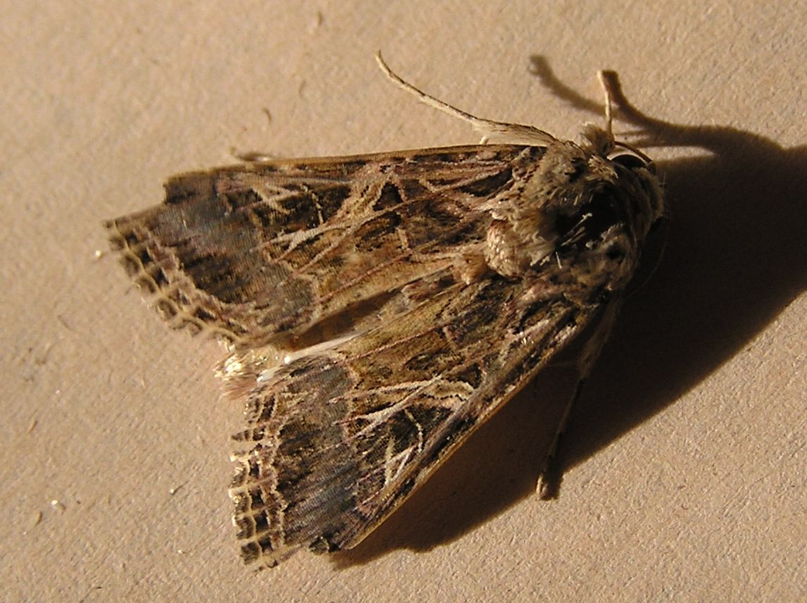
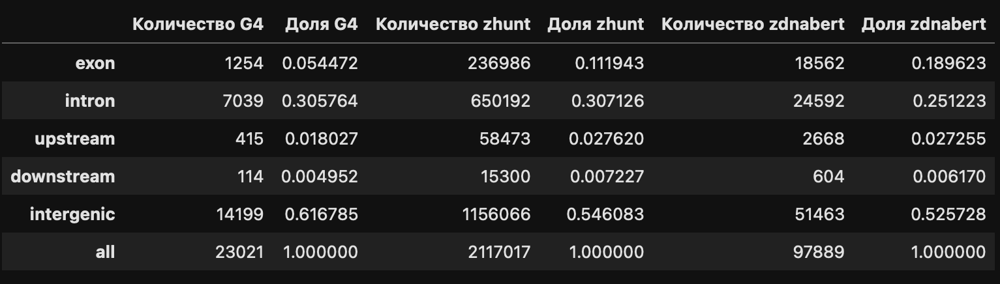

# Spodoptera_littoralis

Геном по ссылке: [NCBI архив](https://ftp.ncbi.nlm.nih.gov/genomes/all/GCA/902/850/265/GCA_902850265.1_PGI_Spodlit_v1/)

Ноутбук с выполненным проектом прикреплен

Основные показатели генома:

| Metric          | Value        |
|-----------------|-------------:|
| Scaffold N50    | 14.8 Mb      |
| Число генов     | 13 280       |
| Длина генома    | 435.6 Mb     |
| PubMed          | 1022         |

Это вид моли из семейства Noctuidae. Он широко распространен в Африке, Средиземноморской Европе и странах Ближнего Востока. Это очень многоядный организм, который является вредителем многих культурных растений.
Оптимальная температура 25 градусов, но хорошо себя чувствует в промежутке между 13 и 40.
Идентифицировано 1995 генов, связанных с детоксикацией, что указывает на высокий уровень адаптивности к среде и пище

Таблица с генами (также в репозитории domains_genes_positions.csv):

Распределение структур по геному:

